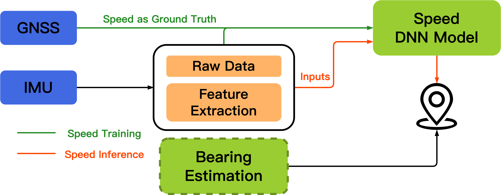
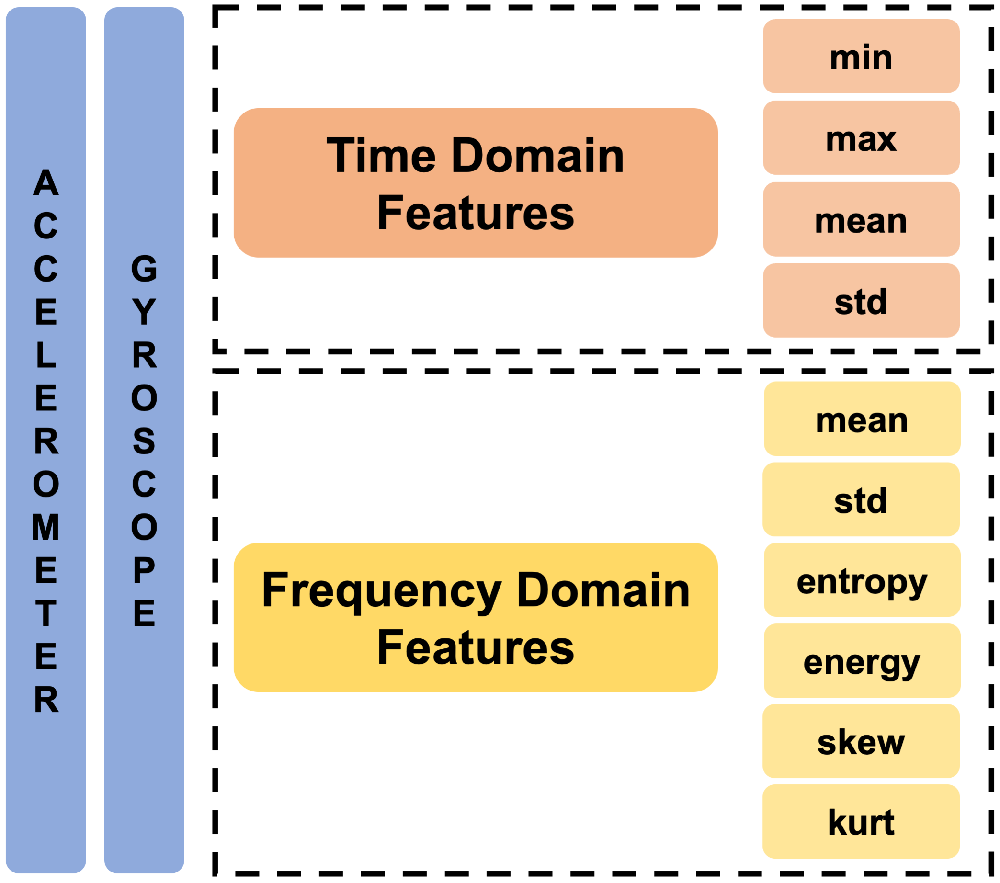
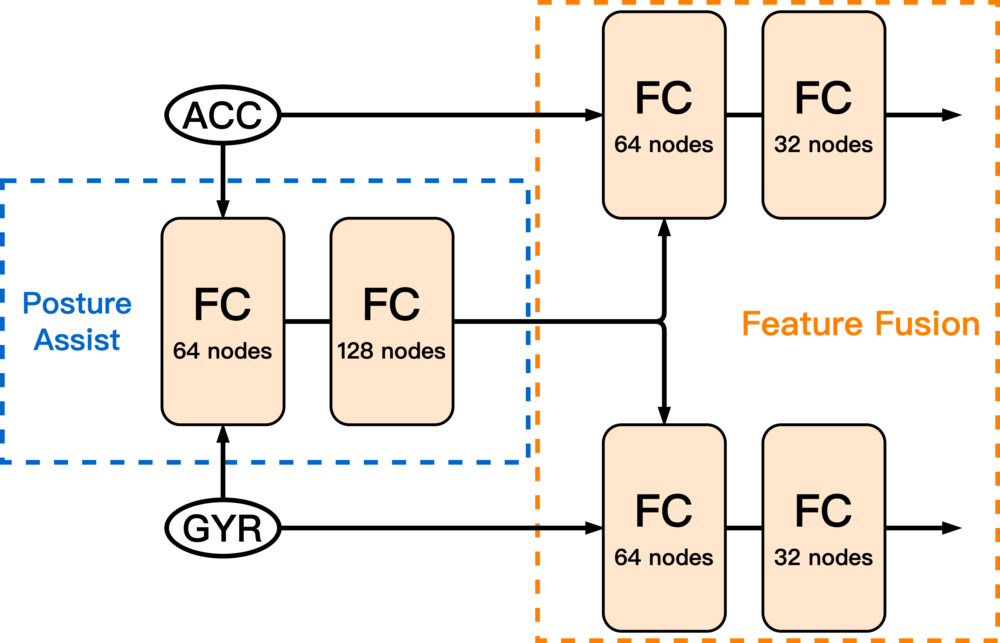

# Detailed Introduction

<!--  -->

Figure 1: System Overview

As shown in Figure 1, different from the traditional speed estimation method based on attitude calculation and acceleration integration, we designed a supervised deep learning model (Speed DNN Model) for estimating vehicle speed, and estimated the vehicle heading (Bearing Estimation) decoupled from the vehicle speed estimation function.

The overall workflow is divided into two lines: model training and model inference. During model training, we use the provided testing data with high-quality GNSS information to build a training dataset with ground-truth speeds. Among them, we have designed two schemes for the use of inertial data. The first solution is to input the original sampled data (Raw Data) into the deep learning model without additional processing of the inertial data. The second solution: we designed a feature extraction module (Feature Extraction) to calculate the features of the three axes of the accelerometer and the gyroscope in seconds. Compared with using the original data directly, the use of the extracted eigenvalues has the disadvantage of losing part of the original data information, but it has the advantages of simplifying the amount of model computation and facilitating subsequent tuning. When using the model to infer the speed, we need to combine the heading angle obtained by the heading estimation algorithm to finally determine the position change of the vehicle.

## Speed DNN Model

We designed the speed network structure into three modules, which are Embedding Layer, Representation Layer and Regression Layer.

### Embedding Layer

<!--  -->

Figure 2: Feature Engineering

The embedding layer is used to process and fuse the features of inertial data. Before introducing the specific embedding layer network design, we need to explain the content of the feature extraction module. As shown in Figure 2, we calculated the second-level eigenvalues of the three-axis accelerometer and three-axis gyroscope's indications per axis: time-domain feature and frequency feature. The time domain feature consists of maximum, minimum, mean and standard deviation. The frequency domain features are obtained from the spectrogram solved by the Fast Fourier Transform, which in turn includes mean, standard deviation, information entropy, energy, skewness and kurtosis. The so-called skewness refers to the skew direction and degree of statistical data; the so-called kurtosis refers to the sharpness of the peak of the value data.

<!--  -->

Figure 3: Embeddiong Layer

The embedding layer takes the features of the accelerometer (ACCE) and the gyroscope (GYRO) or the original values as input, and realizes the re-extraction and effective fusion of such inertial features. The network structure diagram of the embedding layer is shown in Figure 3. We first adopted a two-layer fully connected network. The dimensions of the hidden layer and output layer of the network were 64 and 128, respectively, to extract the fusion features of the accelerometer and the gyroscope. Next, we use a symmetrical two-layer fully connected network, the hidden layer and output layer of the network have dimensions of 64 and 32, respectively, and fuse the extracted feature information with accelerometer features and gyroscope features respectively. The design of the embedding layer is inspired by the traditional mathematical method of calculating attitude, which relies on acceleration and angular velocity. The structure of the embedding layer can reduce the influence of vehicle shake on the final calculation result under the same attitude.

### Representation Layer

<!--  -->

Figure 4: Representation Layer

For the design of the representation layer, we directly choose a representative member of the recurrent neural network - LSTM, or the Encoder module in Transformer. As shown in Figure 4, if LSTM is selected as the main body of the representation layer, we design an LSTM structure with a stacking layer of 1 and a hidden layer dimension of 128; if the Transformer is selected as the main body of the representation layer, we design a multi-layer attention mechanism It is superimposed for the core 4-layer Encoder module.

### Regression Layer

<!--  -->

Figure 5: Regression Layer

As shown in Figure 5, the regression layer takes the output of the representation layer and the initial speed of the vehicle ($Spd_{start}$) as the input, and designs a fully connected network with a depth of 4 layers, in which the dimensions of the hidden layer are 64, 32 and 16. Output the change in walking speed compared to the initial speed during this period of time (one second).

## Heading Estimation Algorithm

In order to realize the calculation of the vehicle's driving trajectory, it is not enough to have speed characteristics alone. It is also necessary to obtain the heading information of the vehicle, that is, which direction is it driving, when and how much has the driving direction changed. Considering that the geomagnetic signal is easily interfered by metal structures and the accuracy is greatly reduced, our system only uses the data from the accelerometer and gyroscope to estimate the heading. Currently, we use the direct integration method.

When the smartphone is in a vertical position, the rotation of the vehicle is around the Y-axis of the smartphone, so it is only necessary to integrate the angular velocity of the Y-axis to obtain the heading change of the vehicle. Nonetheless, due to the shaking of the vehicle, there is still a certain declination angle between the mobile phone and the fully vertical attitude, and we need to further process the data.

As we all know, the direction of gravity is always perpendicular to the ground pointing to the center of the earth, and the coordinate representation of the direction of gravity in the current coordinate system can be approximated by the steady-state accelerometer. It is known that the angular velocity vector collected by the gyroscope in the current coordinate system is $\omega$. Because in the vertical posture of the smartphone, the direction of gravity is the negative direction of the Y-axis, so the $\omega$ can be further rotated and projected. The specific steps are as follows:
1. Calculate the unit vector in the Y-axis direction according to gravity, denoted as $oz$;
2. Project the $\omega$ to the $oz$ direction to get the angular velocity value in the vertical attitude.

Thus, we get the heading change of the vehicle on the plane. However, there is some noise in the data collected by the accelerometer and gyroscope. Therefore, we need to de-noise the data (we use a one-dimensional convolution method to smooth the data), and then perform integration.

